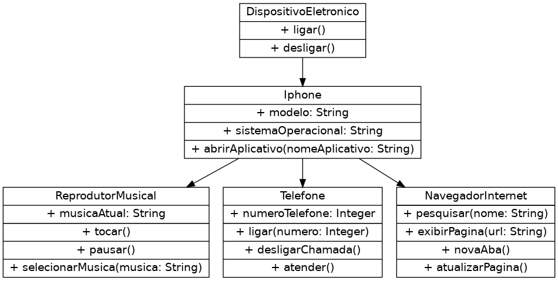

# Projeto iPhone

Este projeto visa modelar as funcionalidades de um iPhone usando programação orientada a objetos.

## Diagrama de Classes

O diagrama de classes abaixo representa a estrutura hierárquica das funcionalidades do iPhone, incluindo um reprodutor musical, telefone e navegador de internet.

### DispositivoEletronico
Classe base para todos os dispositivos eletrônicos, fornecendo métodos básicos como ligar e desligar.

### Iphone
Representa um iPhone, estendendo a classe `DispositivoEletronico`. Inclui atributos como modelo e sistema operacional, além de métodos para interagir com aplicativos.

### ReprodutorMusical
Uma extensão da classe `Iphone` que foca nas funcionalidades de reprodução de música, permitindo tocar, pausar e selecionar músicas.

### Telefone
Outra extensão da classe `Iphone`, esta classe lida com as funcionalidades de telefonia, como ligar, desligar chamadas e atender.

### NavegadorInternet
Esta classe permite ao `Iphone` acessar a internet, pesquisar, exibir páginas e gerenciar abas.

## Contribuições

Contribuições são sempre bem-vindas! Por favor, leia o arquivo CONTRIBUTING.md para detalhes sobre nosso código de conduta e o processo para enviar pedidos de pull.

## Licença

Este projeto está licenciado sob a Licença MIT - veja o arquivo LICENSE.md para detalhes.

## Descrição das Classes

### DispositivoEletronico
Classe base para todos os dispositivos eletrônicos, fornecendo métodos básicos como ligar e desligar.

### Iphone
Representa um iPhone, estendendo a classe `DispositivoEletronico`. Inclui atributos como modelo e sistema operacional, além de métodos para interagir com aplicativos.

### ReprodutorMusical
Uma extensão da classe `Iphone` que foca nas funcionalidades de reprodução de música, permitindo tocar, pausar e selecionar músicas.

### Telefone
Outra extensão da classe `Iphone`, esta classe lida com as funcionalidades de telefonia, como ligar, desligar chamadas e atender.

### NavegadorInternet
Esta classe permite ao `Iphone` acessar a internet, pesquisar, exibir páginas e gerenciar abas.

## Contribuições

Contribuições são sempre bem-vindas! Por favor, leia o arquivo CONTRIBUTING.md para detalhes sobre nosso código de conduta e o processo para enviar pedidos de pull.

## Licença

Este projeto está licenciado sob a Licença MIT - veja o arquivo LICENSE.md para detalhes.
